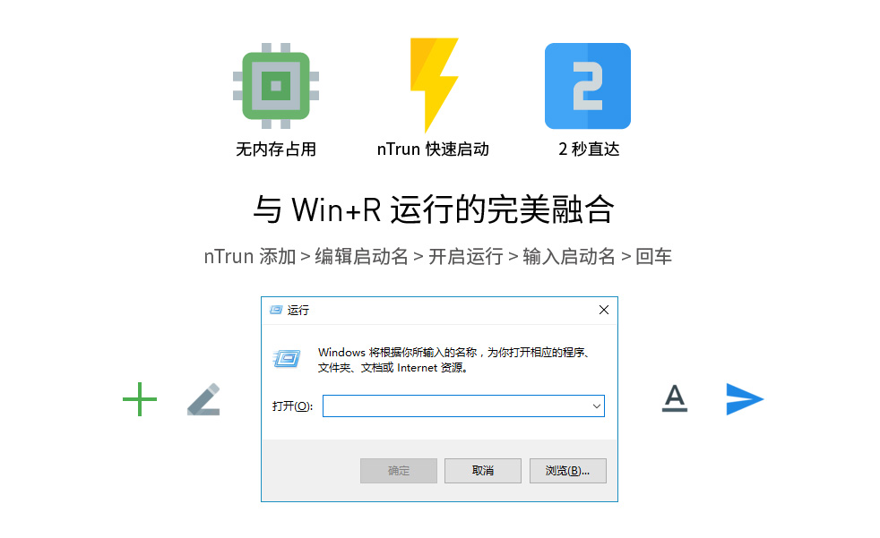
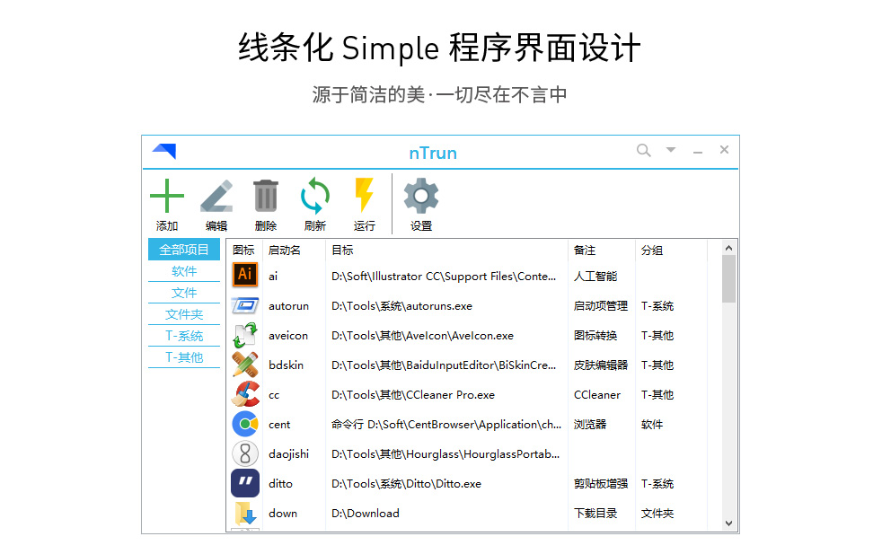
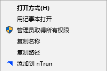
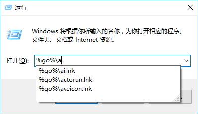
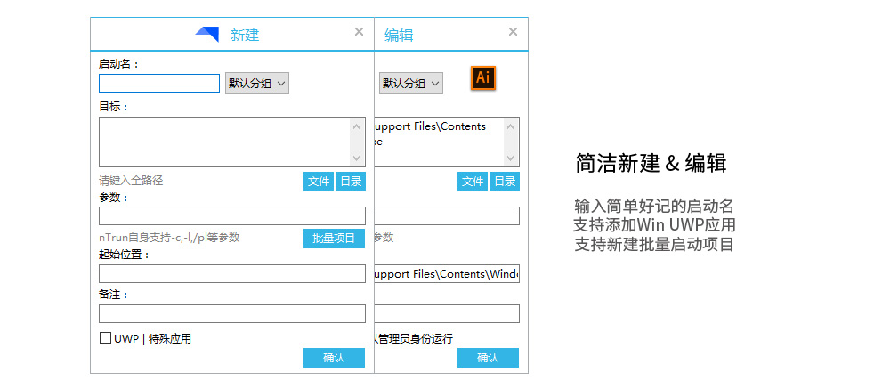
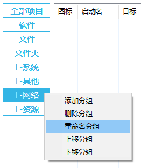
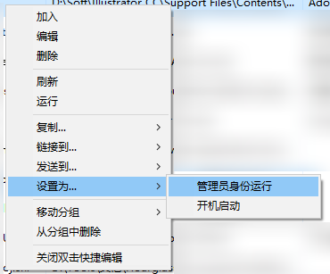
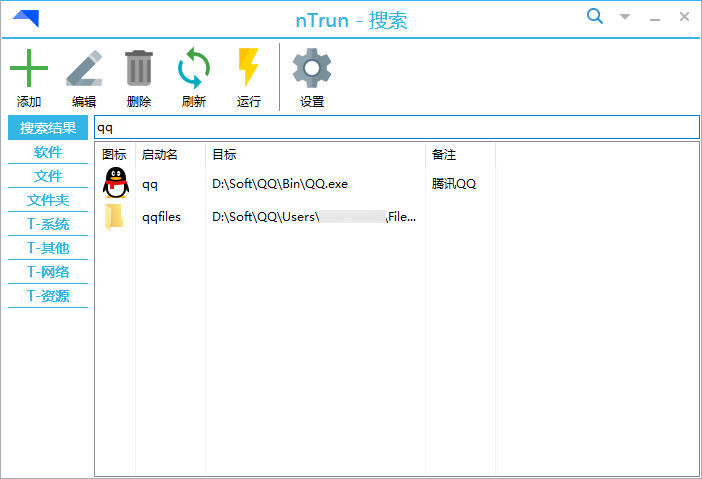
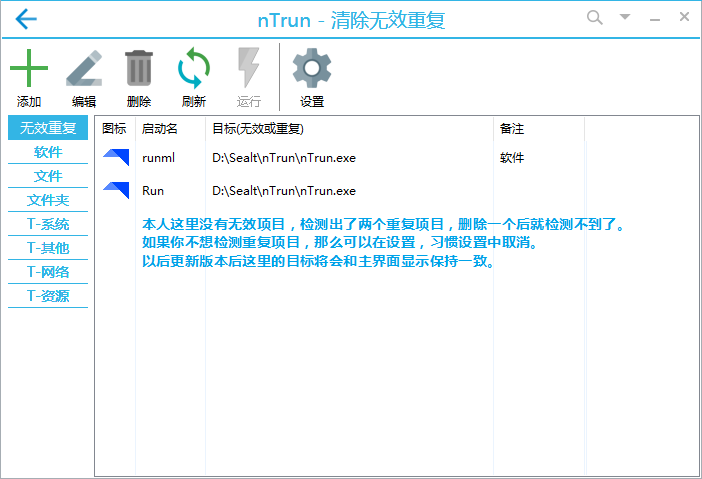
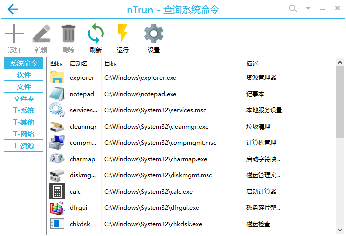

# nTrun

  

  

与 Win+R 运行完美融合的快速启动 | 优秀的本地程序管理工具

## 快速启动

Win+R 模式的快速启动方案，这种方案能够做到在启动程序的过程中，全程使用系统自带功能“运行”，且 nTrun 主程序不参与启动过程，即可处于关闭状态。而 nTrun 要做的就是帮助你添加项目，来让系统能够认识你想快速启动的东西。

## 软件管理

之所以转型本地程序管理，是因为一些特定的需求。因为我们在日常使用电脑的过程中，各种软件、工具、文件夹、文件都会存在于我们的硬盘中，安装类软件可以在系统中查看列表，但是各种绿色软件工具就只能手动查找了，随着时间的流逝，我们可能已经忘记自己电脑中是否有这个工具，届时又去重新下载，反复麻烦。所以，我觉得这类用户迫切的需要一个能够管理本地程序的工具，让你分布在不同地方的软件、工具、文件夹，有个总管家。既能够管理，又能够直接快速启动。

## 下载与安装

您可通过以下渠道下载 nTrun  

* 官方网站：http://www.ntrun.com/
* GitHub：https://ntrun.github.io/
* 网盘直链：http://pan.baidu.com/s/1nt3aP77

下载压缩包后，请将解压文件到固定目录下，双击 `nTrun.exe `开始使用。

如果您是 V2.8 及以前旧版本用户，覆盖到原文件夹，双击 `nTrun.exe `自动为您更新数据并开始使用。

## 界面与功能

### 主界面

一如既往地，从首个版本到现在，nTrun 对线条化简约式设计不断改进，并且重新设计了程序图标，与Material风格图标搭配，支持自定义界面色调和图标，在最大化自定义的前提下保证了界面的统一性。

### 配置

软件提供了非常丰富的自定义选项，就连显示在主界面的软件名称都可以更改，图标显示随你定。

在设置中有一些功能的入口，他们分别是：  

- 右键菜单：将“添加到nTrun”设置到右键菜单，需要添加的项目直接右键即可，非常方便。

- 启动名索引：如果想要在运行界面输入一个字母就出现自动补全的结果，打开即可，触发字符可在自定设置中修改。输入的格式为%字符%\，可以通过输入法的自定义短语实现快捷输入。

- 双击运行项目：使主界面的项目能够通过双击运行。  
- 一键卸载程序：自杀式功能，如果不再使用nTrun请不要直接删除，而是来这里卸载，非常干净。

### 加入与编辑

上文中提到的添加到nTrun就是进入这个界面进行操作的，在这个界面可以直接把要加入的拖进来，如果是UWP应用，需要先勾选左下角的选择框后，拖入UWP应用的快捷方式。当然你也可以通过按钮选择需要添加的东西。**启动名这里建议设置的简单一点，越简单在运行界面进行输入的时候就会越快。**支持新建批量项目，点击按钮后按照界面提示操作即可。EXE文件支持设置为管理员身份启动。

### 信息传达

我们采用了和安卓 Toast 通知类似的提示样式，并且加以修改，背景颜色能够充分的提示用户当前程序的状态。并且非常适合做信息提示，渐入渐出，我们不会做一个需要点“确定”的提示框。

### 程序命令行

简单说这个就是程序自带的一些小功能，功能入口是图中彩色部分。在运行界面输入nTrun启动名，默认为run，然后空格，再输入指定功能的指定字符回车即可。比如我想复制ai的exe文件路径，那么就输入run -c ai回车就直接复制好了，不需要打开程序。

### 分组管理

作为优秀的本地程序管理工具，对项目进行分类这种操作肯定是必不可少的。现在已经支持无限个分组添加，可以通过调程序大小来让分组显示全面。在左侧空白部分右键即可打开菜单。

### 设置管理员、开机启动

一些小程序需要管理员权限运行，那么直接在编辑或右键菜单设置为管理员启动即可。如果程序本身不支持开机启动，那么使用nTrun右键直接设置为开机启动即可。同时，如图，项目右键菜单还支持丰富的复制、链接到、发送到桌面、SendTo等操作。

### 项目搜索

你可以对启动名、目标、备注中的任意字符进行搜索。

### 清除无效重复

时间久了，可能文件已经删除，项目记录没有及时删除，或者记性差重复添加了项目（很少出现，新建项目时候会进行检测如果已经存在会提示，除非您执意添加同目标的项目）。那么使用次清除重复功能即可快速对全部项目进行检索并管理。

### 查询系统命令

既然Win+R是系统自带的功能，那必然有它自己的用武之地，通过此功能我们就可以查询到部分系统命令了。

### 数据存储

nTrun 支持数据导出、导入功能，导出后的文件存储在程序Bak目录下。

## 更新日志

### V3.1.1 2020/3/17 更新日志

1、禁止启动动画播放，解决 Windows10 丢失界面问题  
2、处理检测更新逻辑，设定超时，多源拉取更新信息  
3、添加新项目支持直接添加到系统 SendTo 及桌面快捷方式  
4、菜单支持直接打开系统SendTo所在目录，便于管理  
5、修复右键快捷添加窗口拖动添加失败，识别错误的问题  
6、全新关于页，释放更多信息  
7、新增相关控制面板的系统命令显示  
8、修改检测更新策略为每次启动都会检测

### V3.0.3 更新日志
1、跟进最新编译器，错误提示直达组件。  
2、去除程序原有错误提示管理，遇到报错请截图弹窗反馈给作者。

### V3.0.2 更新日志
1、修复升级V3数据迁移时不支持其他目录  
2、优化检测更新地址始终检测出错的问题  
3、修复未知情况下的分组列宽为0的问题  
4、修复项目过多导致的启动动画丢失问题  

### V3.0.1 更新日志
1、修复创建同名项目覆盖后列表出现两个项目的问题  
2、修复编辑勾选管理员启动模式后加入到开机启动的问题

### V3.0 更新日志

- 新特性  
1、全新引入数据库结构，更稳定的启动与管理  
2、分组模块实现方式改版，支持已分组项目批量转移分组  
3、解除分组新建限制，支持10个及以上分组创建  
4、支持添加UWP应用，直接将桌面UWP快捷方式拖入新建界面添加  
5、支持在主界面列表框目标显示带参数以及UWP应用标注  
6、优化程序启动速度，大幅减少不必要的数据加载  
7、支持设置/取消开机启动项（StartUp）  
8、重构加入/编辑/关于界面，简洁呈现  
9、全新设计图标，简洁耐看随心而动  
10、全新优化导入导出数据，新版备份文件为.nbs  
- 优化  
1、去除关于-使用向导，精简无用功能及菜单  
2、默认对列表框内项目从小到大自动排序  
3、优化设置/取消管理员启动记录问题  
4、添加项目默认选中当前进入的分组  
5、取消对bat、cmd文件的管理员启动支持  
6、右键快捷添加项目支持快捷键N  
7、加入或编辑时目标重复的提示文本颜色为蓝色  
8、默认皮肤Material修改某些工具的图标  
9、频繁刷新图标加载项目的稳定性  
- 修复  
1、检测重复，加入编辑界面的检测显示错误  
2、特殊路径项目编辑无法读取信息  
3、搜索状态下双击编辑编辑框行高问题  
4、只有一个项目的时候双击编辑无法显示编辑框  
5、分组大跨度切换到全部分组时分组名重影的问题  
6、进入配置界面时几率性黑影闪烁问题  
7、搜索模式下双击编辑后项目目标备注错乱问题  
8、双击模式下Alt+E会导致界面变更编辑错乱